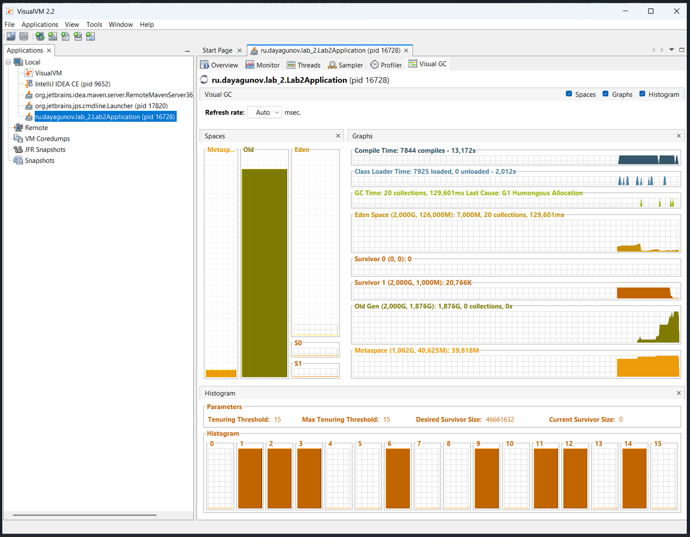
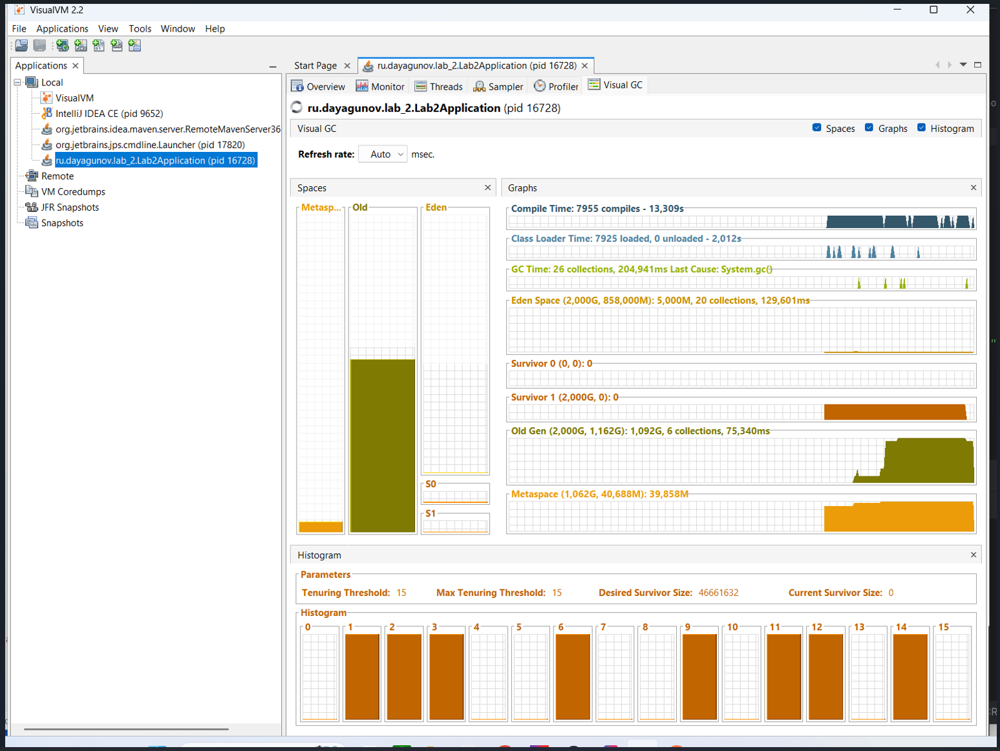
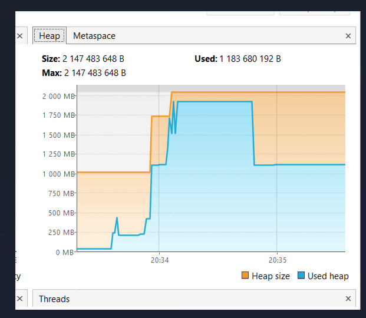

## Отчёт по заданию: Анализ сборки мусора и симуляция утечки памяти в Spring Boot

### 1. Пошаговое описание выполнения задания

Задание выполнено путем модификации предоставленного кода контроллера для симуляции различных типов аллокаций и принудительной сборки мусора, а также настройки запуска JVM для логирования GC.

#### 1.1. Настройка JVM для логирования GC

Для сбора данных о работе сборщика мусора приложение запускалось с флагами, направляющими вывод GC в файл `gc.log`.

**Команда запуска (пример):**

```bash
java -Xms1g -Xmx2g -XX:NewRatio=1 \
     -XX:+UseG1GC -Xlog:gc*=info:file=gc.log:time,tags \
     -jar target/your-application-name.jar
```

#### 1.2. Симуляция работы с памятью и утечка

В предоставленном коде реализованы три ключевых эндпоинта:

1.  **`/pressure` (Искусственная нагрузка на Young Generation):**
    *   **Симуляция:** При вызове создается локальный список, который аллоцирует 100 объектов по 1 МБ каждый (всего 100 МБ).
    *   **Механизм:** Поскольку этот список является локальной переменной, он **умирает** сразу после завершения запроса. Эти объекты должны быть собраны сборщиком мусора в **Minor GC** (сборка Молодой Поколения). 
    * Демонстрирует нормальное поведение GC при высокой, но короткоживущей нагрузке.

2.  **`/leak` (Симуляция утечки памяти):**
    *   **Симуляция:** При вызове добавляется 100 объектов по 10 МБ (всего 1 ГБ) в **статическую коллекцию** `MEMORY_LEAK`.
    *   **Механизм:** Статические поля сохраняют ссылку на коллекцию на протяжении всего времени жизни приложения. Следовательно, все 100 объектов, добавленные в `MEMORY_LEAK`, **не могут быть собраны GC**, даже если они больше не используются кодом приложения. 
    * Это классический пример утечки памяти, ведущий к заполнению **Old Generation** (или всего Heap, если используется G1).

3.  **`/force-full-gc`:**
    *   **Симуляция:** Вызывает `System.gc()` и выполняет короткие синхронные операции с использованием пула потоков (`workExecutor`) для дополнительной стимуляции активности.
    *   **Механизм:** Пытается принудительно инициировать **Full GC**, чтобы проверить, способен ли GC очистить неиспользуемую память (в данном случае, он потерпит неудачу из-за статической ссылки).

4.  **`/work`:** Эндпоинт для имитации фоновой работы без существенного влияния на кучу, позволяющий проверить время отклика под небольшой нагрузкой.

### 2. Анализ GC-логов и Heap Dump

#### 2.1. Анализ GC-логов (`gc.log`)

GC-логи являются первым и самым важным инструментом для понимания поведения сборщика мусора.

**Методы анализа:**

1.  **Поиск Full GC:** В логе необходимо искать события, помеченные как **Full GC** или **G1 Full GC** (или просто очень долгие циклы GC).
2.  **Сравнение размеров:** Анализируется размер кучи **до** и **после** сборки (`Heap before GC` vs `Heap after GC`).

**Наблюдение в логах (при вызове `/leak`):**

*   После вызова `/pressure` мы увидим множество быстрых Minor GC, и размер кучи после них будет возвращаться к базовому уровню (например, 50-100 МБ).
*   После вызовов `/leak` мы увидим, что размер кучи **после GC** продолжает расти. GC будет пытаться собрать мусор, но размер кучи после сборки (например, 500 МБ, затем 1500 МБ) не вернется к базовому уровню, так как объекты в `MEMORY_LEAK` остаются живыми.
*   При попытке принудительного Full GC через `/force-full-gc`, лог покажет, что даже после полного цикла сборки, размер кучи останется высоким, подтверждая, что утечка успешно предотвратила освобождение памяти.

#### 2.2. Анализ Heap Dump (с использованием VisualVM)

VisualVM используется для визуализации и детального анализа дампа памяти (Heap Dump), который берется, когда приложение уже исчерпало большую часть памяти.

**Пример работы с VisualVM:**
*   Графики до вызова GC

*   Графики после вызова GC

*   Общий график по памяти

*   **Вывод:** судя по информации на графиках можно сделать вывод, что память `MEMORY_LEAK` не очищается даже после вызова GC вручную. Отсюда следует, что в программе есть утечка памяти.

### 3. Итоговые выводы и устранение проблем

#### 3.1. Обнаруженные проблемы

Основная проблема — **неконтролируемое заполнение Heap** из-за использования статической коллекции для хранения динамически созданных данных (`/leak`).

*   **Утечка:** Полная невозможность освобождения 1 ГБ+ памяти после вызовов `/leak` подтверждена как в логах GC, так и в анализе Heap Dump.

#### 3.2. Способы устранения

Для устранения утечки необходимо устранить сильную ссылку на объекты в статической коллекции:

1.  **Очистка коллекции:** Ввести новый эндпоинт, который будет вызывать `MEMORY_LEAK.clear()`, чтобы вручную освободить память.

    ```java
    // Добавление в GcController
    @GetMapping("/clear-leak")
    public String clearLeak() {
        int count = MEMORY_LEAK.size();
        MEMORY_LEAK.clear();
        System.gc(); // Принудительно запустить GC для быстрого освобождения
        return "Cleared " + count + " objects (approx " + (count * 10) + " MB). Full GC should now clean the space.";
    }
    ```

2.  **Рефакторинг (Предпочтительно):** Если коллекция нужна для кэширования, ее следует заменить на `WeakHashMap` или использовать механизм, гарантирующий очистку ссылок после того, как на данные нет других ссылок (например, в контексте запроса, а не статически).

После исправления утечки и вызова `/clear-leak`, при повторном запуске `/leak`, а затем вызове `/force-full-gc`, мы бы увидели в GC-логах, что размер кучи после сборки возвращается к начальному значению (1 ГБ).